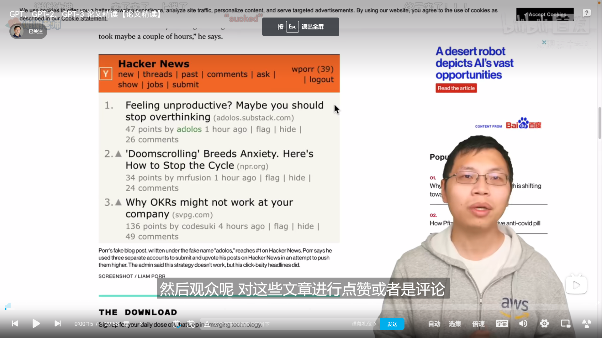

-
- instruct gpt 1.3B
- GPT3 175B
- 先使用数据库的prompt和人工写出的prompt，让人工写答案，这个数据集用来微调模型作为baseline model
- 然后收集模型输出的多种结果的 排名结果，是靠人工标注的。使用该数据训练一个奖励模型，用来预测那种模型输出更为人类所喜爱。
- 然后使用这个RW model作为reward function来微调上面的SFT模型，得到InstructGPT
- 为什么要做奖励模型和强化学习这两步
	- 人工写生成的答案的成本肯定比排序的成本大得多，生成式的标注成本肯定大于判别式的标注
	- 如果第一步的监督数据够多的话，后两部可能也不需要
-
- 关于数据收集
	- 先标注一批，训练一个效果弱一点的模型，然后开放给用户面试玩，收集用户产出，然后不断迭代
- residual dropout是什么
-
- {:height 356, :width 372}
-
- ## gpt模型
- 微调阶段 使用两个目标函数更佳：分类任务的目标函数+ 语言模型目标函数
- Common Crawl 公开数据集，tb级别
- 包含微调步骤的任务，可能效果好是微调过拟合带的，以及预训练数据和微调数据有一定重合度；为了说明预训练的泛化性，我们不做微调，那么在特定的领域是否依然能有不错的表现呢