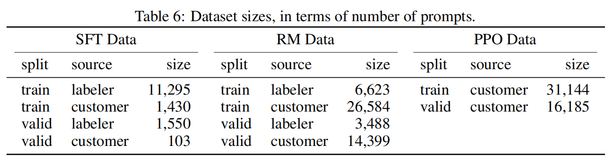

- ## Abstract
- 总结：In this paper, we show an avenue for aligning language models with user intent on a wide range of tasks by fine-tuning with human feedback.
- supervised fine-tune
	- 收集prompt：包括人工写的，以及openAI API收集的
	- 人工手写期望的模型输出内容，构建数据集
- further fine-tune this supervised model with rlhf
	- 收集数据集：a dataset of rankings of model output
- 得到了 InstructGPT，人工评价结果表示：**1.3B参数量的InstructGPT比173B的GPT-3更好**
- 并且在truthfulness and reductions in toxic output方面表现更好，仅有极少量性能损失
- 总结：our results show that fine-tuning with human feedback is a promising direction for aligning language models with human intent.
-
-
- 大语言模型表现差的主要原因是预训练的目标——预测下一个词，和我们希望它更好的遵循指令回答之间是有差异的。因此我们说 language modeling objective is *misaligned*
- 我们通过训练他们遵循人类意图方面取得进展，这包括显示的意图和隐式的意图
- 专注于fine-tune的方式来对齐语言模型。
- 招了40个合同工来书写来自标注员写的prompt和API收集的prompt对应的期望的demonstrations
	- to train our supervised learning baselines
- 然后收集一个数据集（模型在大量的API prompts上的输出的对比排序结果）来训练一个reward model，用于预测标注员更偏好的模型输出。
- 然后使用PPO算法以及RW模型作为reward function来fine-tune之前的SFT baseline模型
- 评测用的prompt不在训练集中
- 训练了三种体量的模型：**(1.3B, 6B, and 175B parameters)**
- ### outputs 完胜GPT-3
	- few-shot也能提升GPT-3的表现。175B的InstructGPT在80+%的情况下优于175B的GPT-3，并且在70+%的情况下优于few-shot的GPT-3
	- InstructGPT models also generate more appropriate outputs according to our labelers, and more reliably follow explicit constraints in the instruction.
- ### show improvements in truthfulness
	- TruthfulQA benchmark 上InstructGPT产生事实回答的数量是GPT-3的两倍
	- 在close-domain（from out API prompt distribution） 任务中产生胡编乱造的结果数量是GPT-3的一半
- ### shows small improvements in toxicity over GPT-3, but not bias
- ### 通过优化RLHF fine-tuning procedure来最小化在公开nlp数据集上的性能损失
	- 观察到RLHF fine-tuning过程中模型相比GPT-3，在一些公开任务上会有性能损失，算是“alignment tax”
	- 措施：mixing PPO updates with updates that increase the log likelihood of the pretraining distribution (PPO-ptx),
- ### 模型在保留标注员（不生产训练数据的标注员）间表现也很好
-
- ### Public NLP datasets are not reflective of how our language models are used.
	- 公共数据集不能反映我们的模型训练过程价值
	- 对比使用human preference data fine-tune GPT-3 和分别使用两个公开数据集fine-tune GPT-3
		- 这两个公开数据集consist of a variety or NLP tasks, combined with natural language instructions
		- 这两个模型比SFT baseline 表现稍微差一点，但是这三个模型都比InstructGPT差得多。
	- **说明数据质量起到决定作用，公开的数据集不理想，你想让它怎么回答，就要提供什么样的微调数据** #思考
	-
	-
- ### InstructGPT 展现了对RLHF fine-tuning分布之外的instructions的很好的泛化性
	- follow  instructions 的能力包括： summarizing code, answer questions about code, and sometimes follows instructions in different languages
	- 即使是一些微调阶段非常罕见的指令也表现不错
	- 在一些几乎很难获得监督信号的任务上也能保持一定的alignment
	- **这个泛化性是怎么来的，为什么chatgpt之前的微调大模型都没有实现这么好的效果** #思考
	-
- ## 2 相关工作
	- Our work can be seen as a direct application of RLHF to aligning language models on a broad distribution of language tasks.
- ### Training language model to follow instructions
	- A consistent finding across studies is that fine-tuning LMs on a range of NLP tasks, with instructions, improves their downstream performance on held-out tasks, both in the zero-shot and few-shot settings.
- ### 修正模型的行为，减少harms
	- 特定的数据集微调
	- 使用另一个语言模型来指导模型推理
-
- ## 3 方法和实验细节
- ### 3.1 三个训练步骤
	- 问题：PPO policies是怎么产生comparison data的
- ### 3.2 数据集
	- deduplicate prompts by checking for prompts that share a long common prefifix, and we limit the number of prompts to 200 per user ID.
	- create our train, validation, and test splits based on user ID，防止测试和验证集中包含训练集中人写的prompts
	- 消除身份信息敏感信息
	- 先让标注员自己写一批prompt来训练第一版InstructGPT用于作为web版使用，进而获取更多用户提交的prompt，第一版使用supervised learning训练的。
		- Plain
		- Few-shot
		- User-based
	- {:height 127, :width 562}
	-
	- ten use cases: generation, open QA, closed QA, brainstorming, chat, rewriting, summarization, classifification, extraction, or other.
	- 并不会使用客户在生产中提问的prompt，而只是playground API上提交的prompt